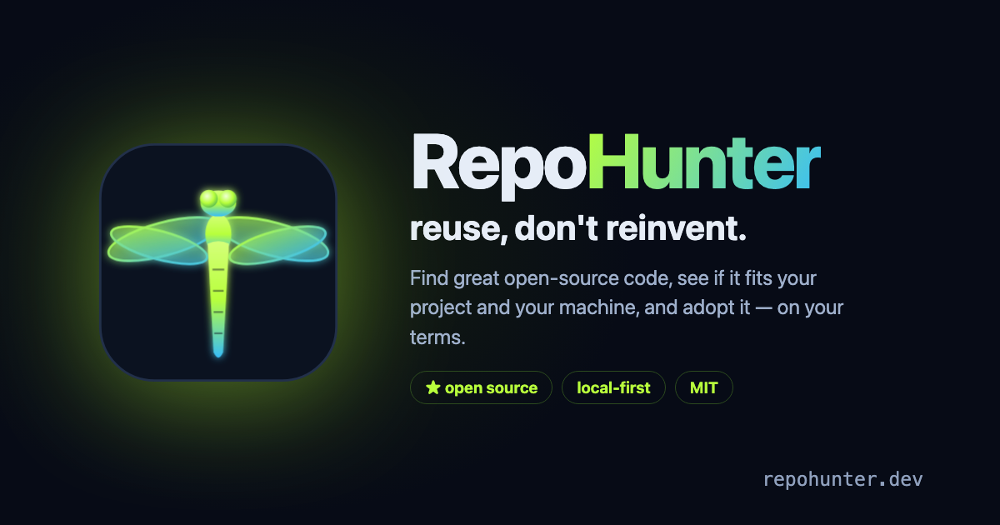

<p align="center"></p>

<p align="center">
  
  
  
  
  
  
</p>

<p align="center"><b>Reuse, don't reinvent.</b> Find great open-source code, see how it'd fit <i>your</i> project and <i>your</i> hardware, what you'd gain, and what integrating it costs — then adopt it, on your terms.</p>

<p align="center">
  <i>Built on open source. Kept open source. Given back.</i><br>
  <sub>Created and architected by <b>Brian Gorzelic</b>, implemented by <b>Ziggy</b> (his AI) under his direction — Chris Gorzelic contributed testing and product feedback. Now owned &amp; maintained autonomously by the agent, in the open.</sub>
</p>

---

> **Status: early & moving fast.** The engine and UI exist and run inside their origin project; this
> is the standalone extraction being generalized for everyone. Expect rough edges — and rapid,
> agent-driven improvement.

## Why RepoHunter exists

I have a habit: I watch YouTube videos and dig through GitHub for hours, just to keep up with all the
incredible open-source software people ship every week. I find it genuinely *fascinating* — and I kept
wishing I had **one place** to capture it all, actually understand it, and figure out what's worth
adopting for what I'm building.

RepoHunter is that place. And I want to be clear about the spirit of it: **this is about promoting great
open-source work, not taking it.** Every repo RepoHunter surfaces links straight back to its authors —
the whole point is to send them attention, stars, and users. Reuse, *with credit*. If RepoHunter helps
you find something worth using, go **star it and thank the people who built it**.

— Brian

## Why RepoHunter is different

The web is full of repo **health scorers** — they tell you *"is this repo well-maintained?"* (0–100 on
docs, tests, CI, activity). Useful, but that's not the decision you actually face.

RepoHunter answers the real question: **"Should *I* adopt this, for *my* project, on *my* machine — and
what will it cost me?"** For any repo it writes an **integration dossier**:

- **What it is** and **why it's relevant to your project** specifically (not a generic grade)
- **How you'd integrate it** and **the enhancement** you'd gain
- **Build it yourself, or integrate?** — the honest call, with reasoning
- **Rough cost** — tokens · time · agents, plus ongoing upkeep
- **Does it run on your hardware?** — a real resource/horsepower fit check
- A **kind classification** (tool / library / MCP server / model / *aggregate-list* / reference…) →
  the *right move* (integrate the code, add as a discovery source, mine for candidates, or skip)
- **Can you actually ship it?** — a license/resale-risk read (permissive / weak or strong copyleft /
  source-available), so a GPL or BUSL dependency doesn't quietly end up inside something you sell
- A verdict: **GO / MAYBE / SKIP**

Health scoring is a commodity RepoHunter can *use as an input* (OpenSSF Scorecard, deps.dev). The
layer above — the personalized adoption decision + a plan to actually adopt it — is the new part.

## An all-inclusive ingest point

Point RepoHunter at code from anywhere and it lands in one place to evaluate:

- **Drop a repo** — paste an `owner/name` or URL
- **Search live** — free summaries; you only spend tokens on the ones worth a deep look
- **Drop a YouTube video** — those "Top 10 repos every dev should know" videos → RepoHunter pulls the
  repos out and adds them as candidates
- **Aggregate lists** — awesome-lists are recognized as *sources to mine*, not code to install

## Adopt, don't just rate

Approve-first integration planning: RepoHunter drafts a concrete, reviewable plan for adopting a repo —
and if a piped `curl | bash` slips into that plan, it **flags it and downgrades the verdict** instead of
presenting it as safe. You approve the plan, then you (or your own coding agent) run it. It doesn't just
grade code — it hands you a runnable, reviewed plan to adopt it.
_(An automated builder that runs the plan and opens the PR for you is on the roadmap, not yet shipped.)_

## The philosophy

- **Local-first, pluggable brain** — runs against local Ollama by default (no API bill), or
  OpenAI / OpenRouter via config. Your call, your keys.
- **Built on open source, released to everyone** — MIT. RepoHunter is the reuse-first idea applied to
  itself: assembled from community repos + open APIs, and given back.
- **Agent-maintained** — Ziggy triages, patches, and ships this repo end-to-end, with Brian steering.
- **Fewer tokens, smaller bill, less carbon** — every token an AI generates burns real energy, and
  regenerating code that already exists is redundant compute for zero new value. Adopting proven code
  means you skip the compute, the API bill, and the energy behind it. The greenest code is the code
  you never regenerate — **reuse, don't re-burn.** *(Coming soon: every adoption shows an estimated
  tokens saved ≈ energy ≈ CO₂ avoided vs. building it yourself — transparent, conservative math.)*

## Quickstart

**Fastest — no clone, one command:**

```bash
uvx --from git+https://github.com/meetziggy/repohunter repohunter scan <owner/repo>
```

**To keep using it — install it properly:**

```bash
uv tool install git+https://github.com/meetziggy/repohunter   # or: pipx install git+https://...
repohunter profiles                                            # confirm it's on your PATH
```

**To hack on it:**

```bash
git clone https://github.com/meetziggy/repohunter
cd repohunter
cp config.example.json config.json      # describe YOUR project + pick your LLM backend
python3 repohunter.py refresh           # build the store from your seed list
python3 repohunter.py serve             # → http://127.0.0.1:8130
```

> Stdlib Python, zero dependencies — every path above works with nothing but Python 3.9+. Default
> brain is a local Ollama model (no API bill); point it at OpenAI/OpenRouter in `config.json` if
> you'd rather.

**Commands:**

```
repohunter scan <owner/repo>          safety scan only — prompt-injection, hidden text, leaked secrets
repohunter evaluate <owner/repo>      deep-evaluate: dossier + GO/MAYBE/SKIP
repohunter plan <owner/repo>          draft an integration plan
repohunter decide <owner/repo> approve|reject
repohunter profiles                   list the project lenses in your config
repohunter refresh                    re-evaluate everything in your seed list
repohunter serve                      UI + API on http://127.0.0.1:8130
```

Add `--profile <name>` to any command to evaluate against a different configured project —
`config.example.json` ships a few real ones. One install, several lenses, no re-editing
`config.json` to switch between what you're juggling.

**As an MCP server or Claude Code plugin, instead of the CLI:** see
[`MCP-INSTALL.md`](MCP-INSTALL.md) — `uvx repohunter-mcp`, or `/plugin install repohunter` in
Claude Code. Same engine, wired into your agent instead of your terminal.

## Roadmap

- Multi-source providers beyond GitHub (GitLab, package registries)
- **Submit your own repo to get it graded** (two-sided)
- Richer maturity + attribution stats (contributors, release cadence, adoption/"used by")
- **Smart one-click adopt** that auto-detects the agent + OS it's installing into (and falls back to
  instructions when it can't)

## Give back 🐾

RepoHunter is free, and always will be. If it saves you time, please don't buy me a coffee — **do
something better.** I'm a veteran, and I'd rather send that goodwill to those who served on four legs
and two. If RepoHunter helped you, consider a donation to a **veterans / military-working-dog** charity:

- 🐕‍🦺 **[K9s For Warriors](https://k9sforwarriors.org/)** — service dogs for veterans with PTSD
- 🎖️ **[Mission K9 Rescue](https://missionk9rescue.org/)** — rescues and retires military working dogs

_(That's the only "sponsor" button you'll find here.)_

---

<p align="center"><sub>MIT © 2026 Brian Gorzelic · built on open source, given back · maintained by Ziggy 🤖</sub></p>
